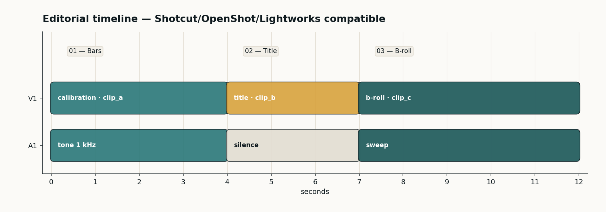

<div align="center">

# Video Production Portfolio

### Senior Video Production Professional · Editorial · Captions · OTIO & EDL Interchange

[🌐 **Live portfolio site**](https://katherinejenniferhsfeemster.github.io/video-production-portfolio/) · [GitHub repo](https://github.com/katherinejenniferhsfeemster/video-production-portfolio)

      

*End-to-end, code-first video production — FOSS NLE project generators, OpenTimelineIO + CMX-3600 interchange, R128-compliant loudness, broadcast-safe captions.*

</div>

---

## Contents

- [Highlighted projects](#highlighted-projects)
- [Reproducibility](#reproducibility)
- [Tech stack](#tech-stack)
- [Editorial style](#editorial-style)
- [Repo layout](#repo-layout)
- [About the author](#about-the-author)
- [Contact](#contact)

---

## Hero



---

## Highlighted projects

| Project | Stack | What it proves |
| :-- | :-- | :-- |
| **[AI dataset video curation](projects/ai-dataset-curation/)** | ffmpeg · PySceneDetect · aHash | Raw footage into a versioned, deduplicated, normalised training set. |
| **[Shotcut MLT project generator](projects/shotcut-mlt-generator/)** | Python · MLT XML | Programmatic `.mlt` projects with producers, playlists and dynamic text. |
| **[OpenShot + OpenTimelineIO](projects/openshot-osp-builder/)** | Python · OSP · OTIO | Cross-NLE interchange so the same cut opens in OpenShot or any OTIO tool. |
| **[Lightworks EDL export](projects/lightworks-edl-export/)** | CMX-3600 · 33pt .cube LUT | Finishing hand-off to Lightworks / Resolve with a matching editorial LUT. |
| **[Auto-captioning + burn-in](projects/auto-captioning/)** | Whisper (optional) · SRT · ffmpeg | Accessible captions with broadcast-safe margins for social and research decks. |

---

## Reproducibility

```bash
pip install opencv-python scenedetect opentimelineio matplotlib numpy
python3 scripts/python/run_all.py    # builds every artefact from nothing
```

Nine stages produce the `.mlt`, `.osp`, `.otio`, `.edl`, `.cube` and a final 1080p30 demo cut. Whisper is optional and gated on `WHISPER=1` so CI stays offline.

---

## Tech stack

- **Editing NLEs** — Shotcut (MLT), OpenShot (OSP), Lightworks, Kdenlive · pvpython-style programmatic project authoring.
- **Interchange** — OpenTimelineIO 0.17, CMX-3600 EDL, AAF, FCP7 XML, XMEML.
- **Grading & LUTs** — 33-point `.cube` 3D LUTs, Rec.709 → editorial, scopes (waveform, parade, vectorscope).
- **Audio** — ffmpeg `loudnorm` EBU R128, `-23 LUFS` integrated, `-2 dBTP` true-peak, LRA ≤ 7.
- **Captions** — WebVTT / SRT / TTML, Whisper v3 for drafts, broadcast-safe 5 % title / 10 % action-safe margins.

---

## Editorial style

- **Palette** — teal `#2E7A7B` + amber `#D9A441` on ink `#0F1A1F` / paper `#FBFAF7`.
- **Type** — Inter (UI) + JetBrains Mono (code, netlists, timecode).
- **Determinism** — every generator is seeded; PNG, CSV and project-file bytes are stable across CI runs.
- **Licensing** — every tool in the pipeline is FOSS. No commercial SDK in the dependency tree.

---

## Repo layout

```
video-production-portfolio/
├── projects/                    # five case studies with their own READMEs
├── scripts/python/              # 9 generators — the source of truth
├── scripts/projects/            # .mlt / .osp / .otio / .edl / .cube artefacts
├── assets/data/                 # raw + curated synthetic clips
├── assets/renders/              # posters (timeline, scene grid, waveform, caption)
├── assets/demo/                 # final cut + captioned demo
├── docs/                        # GitHub Pages site
└── .github/workflows/           # CI re-runs the whole pipeline on push
```

---

## About the author

Senior video production professional with editorial, motion and technical supervisor experience. Comfortable owning a project from raw footage ingest through finishing, captioning and delivery — with a bias for reproducible, code-driven pipelines over manual NLE sessions.

Open to remote and contract engagements. This repository is the living portfolio companion to my CV.

---

## Contact

- GitHub — [@katherinejenniferhsfeemster](https://github.com/katherinejenniferhsfeemster)
- Live site — [katherinejenniferhsfeemster.github.io/video-production-portfolio](https://katherinejenniferhsfeemster.github.io/video-production-portfolio/)
- Location — open to remote / contract

---

<div align="center">
<sub>Built diff-first, editor-second. Every figure on this page is produced by code in this repo.</sub>
</div>
